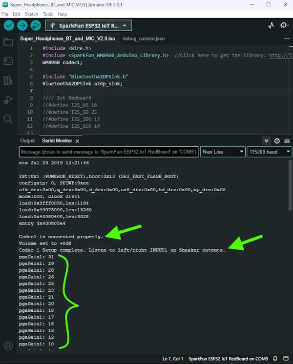
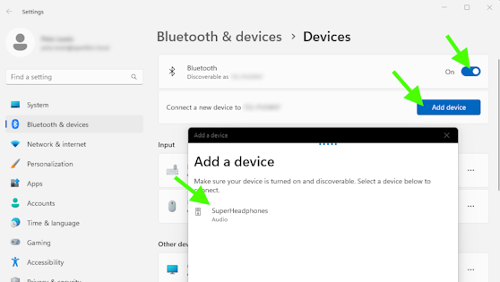
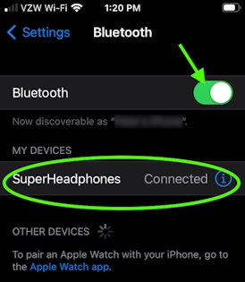

Now that we have our libraries installed, we can compile and upload the Arduino code 
to the ESP32 Thing Plus.

## Serial Upload

Below is the Arduino sketch INO for this project. Copy and paste the code below in your Arduino IDE.

??? code "Example 1: ENS160 and BME280 Combined Examples"
    === "Ex1_Combined_Basic_Example_ENS160_BME280.ino"
        ``` c++ linenums="1"
        --8<-- "https://raw.githubusercontent.com/sparkfun/SparkFun_Environmental_Combo_Breakout_ENS160_BME280_QWIIC/main/Firmware/Ex1_Combined_Basic_Example_ENS160_BME280/Ex1_Combined_Basic_Example_ENS160_BME280.ino"
        ```

Select your board in the Tools menu (in our case **ESP32 Thing Plus**) and the correct Port it enumerated on and click "Upload". After uploading the code, open the [Serial Monitor](https://learn.sparkfun.com/tutorials/terminal-basics) or terminal emulator of your choice with the baud rate set to **115200**. You should see the following message pop up. And then as you turn the volume potentiometer, the setting value will be printed to the terminal.

<div style="text-align: center;">
  <table>
    <tr style="vertical-align:middle;">
     <td style="text-align: center; vertical-align: middle;"><a href="../assets/img/Arduino_Terminal_Print_Out.png"></a></td>
    </tr>
  </table>
</div>

If you see the above messages in your terminal, then you should be ready to try 
out some listening. Put your headphones on and try adjusting the potentiometer. 
As you turn the knob (clock-wise), this will increase the volume level of the 
microphones. 

One way to verify the system is to turn the volume all the way up and 
gently rub each microphone with your fingertip. You should hear a quiet scratching 
sound in the corresponding headphone ear speaker.

Note, if you hear a lot of buzzing, it is most likely the USB cable. Try unplugging 
the USB cable, and powering only from the battery. The battery will be a much quieter 
power source, and so should not add any noise into the audio signal. 

## Wireless connection

In addition to the messages sent to the serial terminal, the provided code sets up 
the ESP32 Thing Plus to be an audio receiver as a bluetooth A2DP Sink.

After powering up your headphones, use your PC or cell phone to find a bluetooth 
device named "SuperHeadphones". 

<div class="grid cards" markdown align="center">

-   <a href="../assets/img/pc_bt_connect.png">
	<figure markdown>
	
	</figure>
    </a>

    ---
        
    **Connect BT with your PC**</a>

-   <a href="../assets/img/cell_bt_connect.jpg">
	<figure markdown>
	
	</figure>
    </a>

    ---
    
    **Connect to BT with your cellphone**</a>

</div>


Click Connect. Now you can play audio from your 
PC program or phone app and listen on your superheadphones! 

Note, the volume control 
for this sound source is controlled by adjusting the setting on your computer or 
cell phone. The knob on the headphones is only used to adjust the volume of the ambient 
microphones.


## Diving deeper

The provided code for this project is a combination of other Arduino example 
sketches. Review these for further information on how each section of the code works. 

* WM8960 Arduino Library Examples:

    * [Example 3: Line Input 1](https://learn.sparkfun.com/tutorials/audio-codec-breakout---wm8960-hookup-guide/all#example-2-line-input-2)

    * [Example 9: I2S Bluetooth](https://learn.sparkfun.com/tutorials/audio-codec-breakout---wm8960-hookup-guide/all#example-9-i2s-bluetooth)

    * [Example 10: ADC Gain](https://learn.sparkfun.com/tutorials/audio-codec-breakout---wm8960-hookup-guide/all#example-10-adc-gain)

* ESP32-A2DP Arduino Library Examples:
    
    * [bt_music_reciever_simple](https://github.com/pschatzmann/ESP32-A2DP/blob/main/examples/bt_music_receiver_simple/bt_music_receiver_simple.ino)
    
    * [I2S pin defnition](https://github.com/pschatzmann/ESP32-A2DP/tree/main#defining-pins)
    
    * [I2S configuration](https://github.com/pschatzmann/ESP32-A2DP/tree/main#using-your-specific-i2s_config)
