<!-- This section goes into detail about the various components on the product, solder jumpers as well as the board dimensions with a dimensional drawing exported from Eagle. -->

## Block Diagram

Here is a high-level block diagram of the sound system inside the headphones. The Audio Codec is central to this design. It handles all of the sound inputs and outputs. The ESP32 Thing Plus is still the "brain", and it is necessary  to setup and control the codec with I2C. The ESP32 also receives the wireless audio (BT), and then sends that to the codec, digitally, with I2S audio data lines.

<figure markdown>
[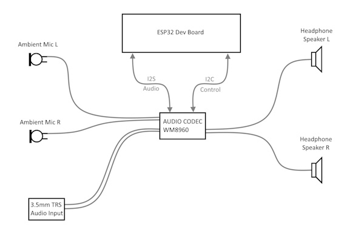{ width="600" }](../assets/img/Super_Headphones_Block_Diagram_v01.jpg "Click to enlarge")
<figcaption markdown>
High level block diagram of the headphone system.
</figcaption>
</figure>

## Exploded View

Here is an exploded view of the headphones. It took a little experimenting and tinkering to eventually disassemble all of the parts. In this section, we will share a few techniques we learned along the way during this hack.

<figure markdown>
[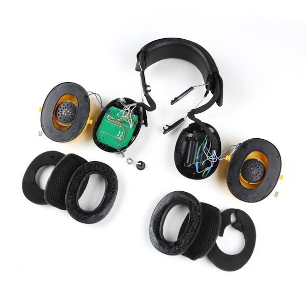{ width="600" }](../assets/img/superheadphones_exploded.jpg "Click to enlarge")
<figcaption markdown>
Exploded view of the headphone system.
</figcaption>
</figure>

## Foam Removal

Removing the foam was pretty straight forward. You can use a flat head screwdriver or pliers, but be careful. As you can see, I accidentally ripped the foam apart when I pulled a bit too hard.  

<figure markdown>
[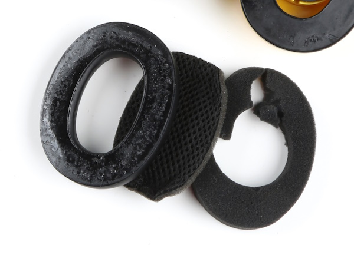{ width="600" }](../assets/img/foam_ripped.jpg "Click to enlarge")
<figcaption markdown>
Oops! I accidentally ripped the foam.
</figcaption>
</figure>

It's really best to take it slowly and pull it gently, little-by-little. I really got the hang of this by the end of this project. I must have taken mine apart nearly 50 times as I fine tuned the wiring and swapped out microphones during testing. Hopefully, by reading this tutorial, you can keep this dis-assembly and reassembly cycle to a minimum. :)

## Screws

After you remove the foam, this will expose the screws that hold the outer and inner parts of each can together.

<figure markdown>
[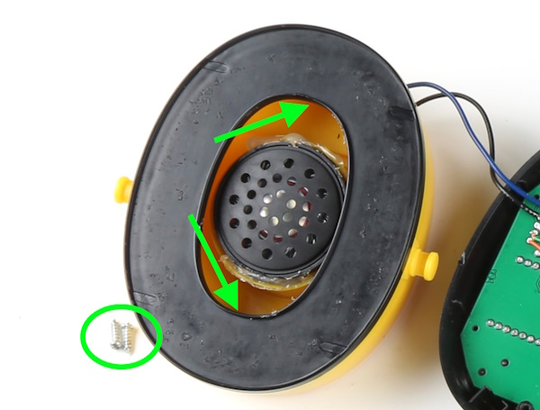{ width="600" }](../assets/img/hp_screws.jpg "Click to enlarge")
<figcaption markdown>
Two small screws hold the cans together.
</figcaption>
</figure>

The screws are located back behind the black plastic. Because of the angle, they can be a little difficult to access, but with a small Phillips head screwdriver and the right amount of pressure, it can be done.

## Knob and PCB removal

When the inner screws are removed, the cans come apart, and then you will see the original electronics (blue). The volume knob is simply pressure fitted onto the potentiometer shaft, so you can pull that directly off. Unscrew the potentiometer mounting nut and the four mounting screws, and you will then be able to remove the original electronics.

<figure markdown>
[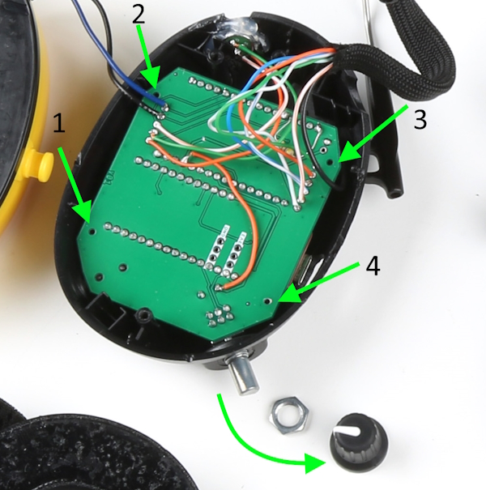{ width="600" }](../assets/img/knob_removal.jpg "Click to enlarge")
<figcaption markdown>
Knob, nut, and 4 mounting screws removed.
</figcaption>
</figure>

## Custom PCB Assembly

Note, the custom PCB is not 100% necessary to complete this project. My early prototype "V2" was a hand-wired version. If you decide to go that route, then referencing the [custom PCB Schematic PDF](../assets/board_files/Super_Headphones_Schematic_v20.pdf) would be a good guide.

If you do decided to order the custom PCB (or a version of your own), the "mother board" PCB will need some assembly too:

* Use headers to solder in the Audio Codec and ESP32 Thing Plus.

* Solder into place the PTH right-angled potentiometer/switch.

* Solder into place the SMD 3.5mm TRS audio input connector.

-   <a href="../assets/img/v2_hand_wired.jpg">
	<figure markdown>
	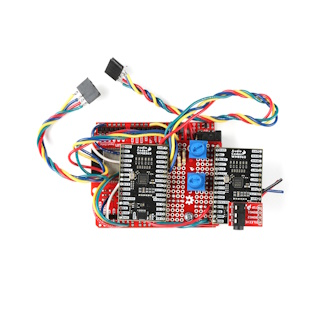
	</figure>

    ---

    **Early Prototype V2**</a>

-   <a href="../assets/img/custom_pcb.jpg">
	<figure markdown>
	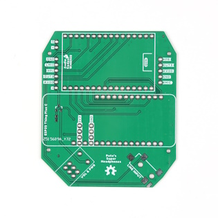
	</figure>

    ---

    **Bare Custom PCB**</a>

-   <a href="../assets/img/custom_pcb_assembled.jpg">
	<figure markdown>
	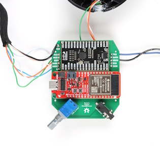
	</figure>

    ---

    **Assembled Custom PCB**</a>

<i>Click images for a closer view.</i>

## Wiring Diagram

Once everything is opened up, and you have your custom PCB assembled, you can begin wiring up the remaining necessary connections: microphones, speakers, and battery.

Before you dive into soldering things up, here are three important things to remember:

* Use 26 gauge wire for most of the connections, as it can get fairly tight in there. I used an old Ethernet cable which had 8 conductors. If you open those up, the resulting hookup wire is quite nice to work with, and has great coloring to keep things straight.

* The left microphone signal and its ground connection must use a shielded cable. If you wire it up with bare hook-up wire, then you will be prone to picking up strange sounds like distant radio stations and creeping whining noises with varying frequencies. Kind of fun, but not ideal for every listening experience.

* The microphones we ultimately chose require a specific power and signal circuit (see below).

Here is a wiring diagram to show all the connections in one place:

<figure markdown>
[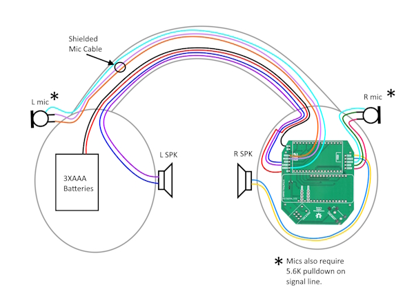{ width="600" }](../assets/img/SuperHeadphones_Wiring_Diagram.jpg "Click to enlarge")
<figcaption markdown>
Wiring Diagram. Lots to hook up!
</figcaption>
</figure>

## Microphone Circuit

Here is the required circuit from the datasheet of the PUI Audio AOM-5035L.

<figure markdown>
[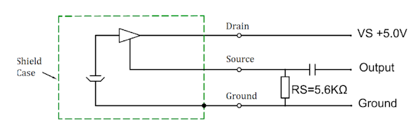{ width="600" }](../assets/img/mic_circuit.png "Click to enlarge")
<figcaption markdown>
AOM-5035L Microphone Signal & Power Circuit
</figcaption>
</figure>

Note, the capacitor is already included on the WM8960 input, and so we only need to wire up the [pull-down resistor](https://learn.sparkfun.com/tutorials/pull-up-resistors/all#what-is-a-pull-up-resistor) of 5.6K on the signal. Put this pull-down resistor as close to the microphone as possible. The left microphone is the only one that is more susceptible to picking up noise, and so we found that having the pull-down in that ear-can (and using a shielded mic cable) eliminated any unwanted noise.

As a side note, the proximity of the pull-down resistor to the microphone also had an effect on the acoustic overload point (AOP). Strangely, if the resistor was placed too far away, then the mics begin clipping at lower sound source volumes. During my early testing, I would hear clipping in my left ear when I really played hard on the hi-hats (which are probably the loudest and closest drum instrument to that microphone). But as soon as I moved the pull-down closer to the mic, the clipping
went away!

Here is some close up shots of where I ended up hacking in the final position of each pull-down resistor. Note, I didn't have the exact 5.6K&ohm; resistors required, so for the left ear, I used two 2.2K&ohm;s in series. And for the right, I used a 4.7K&ohm;.

-   <a href="../assets/img/left_pull_down.jpg">
	<figure markdown>
	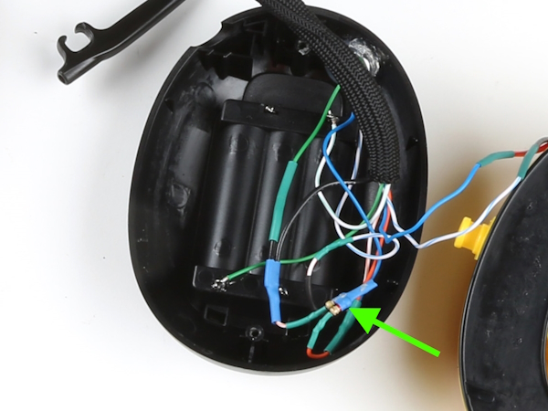
	</figure>
    </a>

    ---

    **Left mic pull-down resistor**</a>

-   <a href="../assets/img/right_pull_down.jpg">
	<figure markdown>
	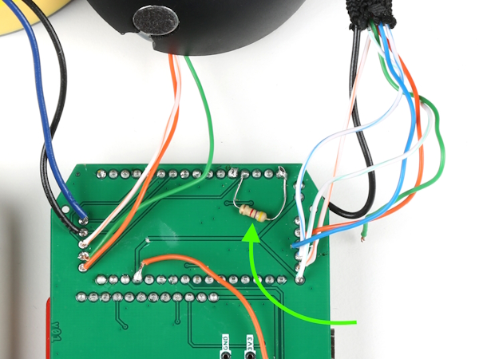
	</figure>
    </a>

    ---

    **Right mic pull-down resistor**</a>

