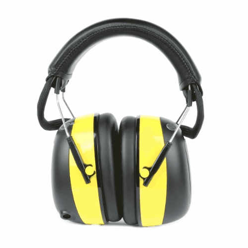
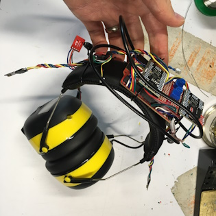
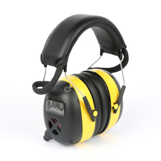
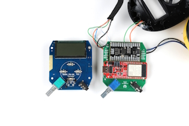
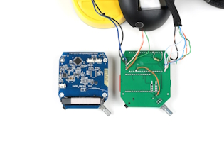

This tutorial will guide you through how to build your own wireless and/or wired headphones with ambient microphones. We start with some off-the-shelf headphones intended for use while lawn mowing, and then hack in some new electronics to allow wireless (BT), auxiliary 3.5mm TRS input, and stereo ambient microphones. The original purpose of this project was to make it easy and safe to play loud music with a rock band in the basement, however, the inclusion of the natural sounds around you into your listening experience can be useful in many other situations.

-   <a href="../assets/img/hp_rotate1.gif">
	<figure markdown>
	
	</figure>

    ---

    **Headphones with Ambient Mics**</a>

-   
<a href="https://www.youtube.com/embed/NvHIXSyEeDA?start=499">
    <iframe width="560" height="315" src="https://www.youtube.com/embed/NvHIXSyEeDA?start=499" title="YouTube video player" frameborder="0" allow="accelerometer; autoplay; clipboard-write; encrypted-media; gyroscope; picture-in-picture; web-share" allowfullscreen></iframe>

    ---

    **Project Demo Video**</a>

### Background

The first prototype design was sparked up around the time I was designing the [Qwiic Speaker Amp](https://www.sparkfun.com/products/20690) in August of 2022. Now, over a year later, it has been through three major versions:

-   <a href="../assets/img/history1.jpg">
	<figure markdown>
	
	</figure>

    ---

    **August 2022 - "V1" Qwiic Speaker Amp**</a>

-   <a href="../assets/img/history2.jpg" >
	<figure markdown>
	
	</figure>

    ---

    **November 2022 - "V2" WM8960 Codecs**</a>

-   <a href="../assets/img/history3.jpg">
	<figure markdown>
	
	</figure>

    ---

    **February 2023 - "V3" Custom PCB**</a>

With this project, I was trying to solve three problems:

1. ) I want to be able to lower all barriers to practicing music. The less things I have to setup, the better!

2. ) When I play drums, I need to protect my ears from getting damaged from exposure to extremely loud sounds. To do this, I usually wear in-ear monitors (IEMs). IEMs are kind of like headphones, but they are more like earbuds. They are usually custom-molded to your ear canal. In this way, they are actually working much like ear plugs and blocking out loud sounds while still providing sound to your ears. In order to get a great monitor mix, I then need to set up mics and a sound mixer. You can accomplish this with headphones too, but most do not provide a safe amount of sound-isolation. IEMs are great, but they are also very expensive. They can range from $300 to $3,000.

3. ) My eight year old son is playing loud music more and more (acoustic drums, amplified guitar and keyboards), and I want him to be able to protect his hearing while still being able to rock out and hear the music clearly. Over-the-ear hearing protection (aka “Ear Muffs”), do a great job of protecting your hearing, but they also dampen the sound way too much. In addition to missing out on many of the mid and high frequencies, it can be very difficult to hear your own instrument and even your band mates.

My idea of a perfect solution:

* Over-the-ear headphones that have stereo ambient mics to mix in!

* Very easy to “pop on”, with no cables attached. Nothing to wire up, just pop them on and go.

* Mix in a desired level of the ambient mics using a single knob, essentially a “more ears” knob - right there on my headphones, at the ready to adjust as needed.

* Battery powered, 100% self contained, wireless. During some jam sessions with the kiddos, we will quickly trade instruments. We need to be able to jump around the room, free from wires and/or plugging and unplugging things.

* The ability to mix in a line level audio source (for practice tracks or other monitor signals from a mixer). This could come in handy for more advanced monitor sound system setups, where maybe I am getting a feed from the mixer that contains the rest of the musicians I am playing with.

* And icing on the cake, a Bluetooth&reg; optional input. This last thing was really more useful for me during my solo practice sessions. I can load my phone up with my practice tracks and wirelessly connect to my headphones. Also, of course, useful for general listening.

### Headphones

For this project, we chose over-the-ear headphone that provide a large amount of sound dampening (30dB). These types of headphones are also called ear-muffs and are often marketed for use during loud construction work or lawn mowing.

The exact headphones we chose to start with were the following:

[Smoostart Am/Fm Radio Hearing Protector, Noise Reduction Safety Ear Muffs, 30dB Noise Cancelling Ear Protection](https://www.amazon.com/Smoostart-Cancelling-Protection-Snowblowing-Construction/dp/B08M95FP4X){ .md-button .md-button--primary }

When using this type of lawn-mowing headphones without any modification, they provide adequate sound dampening to protect your ears in extremely loud places. However, with this benefit, you also lose the ability to hear your natural surroundings clearly. Usually, it is described as sounding a bit like two pillows are held to either ear. This is because the passive sound dampening is blocking most of the high frequencies.

In order to get the sound clarity back, we need to use ambient microphones. The correct type of microphone can accept the loud sound sources without distortion. This type of microphone is said to have a high acoustic overload point, or AOP. We can send that clean audio signal from the microphones into the headphones at a safe listening level. In addition to a high AOP, the microphones also need to have a large signal to noise ratio (SNR), which helps avoid having too much "hiss" in the audio signal. Choosing the best microphone for the job turned out to involve a lot of testing. More on this later.

### The Modification

In addition to sound dampening, the original electronics included the ability to listen to FM radio and plug in a 3.5mm TRS audio cable. In this tutorial, we will remove the stock electronics, and replace them with the SparkFun ESP32 Thing Plus and the WM8960 Audio Codec. The following two pictures show a comparison of the original electronics (blue) and our new version (green/red/black). We took pictures of the topside and backside of each for a more thorough comparison.

The new version actually includes three PCBs. The red microcontroller is the SparkFun Thing Plus ESP32. The black PCB is an early prototype of the SparkFun Audio Codec Breakout. The green PCB below is a custom "mother board" that makes some connections between the two dev boards and provides the on/off/volume knob, 3.5mm TRS input, and mounting holes to mount this entire assembly into headphone can.

-   <a href="../assets/img/hp6_1000wide.jpg">
	<figure markdown>
	
	</figure>
    </a>

    ---

    **Topside**</a>

-   <a href="../assets/img/hp7_1000wide.jpg">
	<figure markdown>
	
	</figure>
    </a>

    ---

    **Backside**</a>

<i>Click images for a closer view.</i>

Using the WM8960 Audio Codec Breakout, we can mix together sound sources. In this use case, we are mixing together three sound sources:

1. ) Wireless (aka "BT") audio from the ESP32 to the codec via I2S audio.

2. ) Wired audio from a 3.5mm TRS audio jack (common headphone cable connector).

3. ) Ambient microphones mounted to either sides of each ear-can, to provide a pair of stereo room mics to your listening experience. In a way, these microphones are "giving you your ears back". Most importantly, doing so at a safe volume, to prevent hearing loss.

### Required Materials

To follow along with this tutorial, you will need the following materials. You may not need everything though depending on what you have. Add it to your cart, read through the guide, and adjust the cart as necessary.

* 1x [SparkFun Thing Plus - ESP32 WROOM (USB-C) [WRL-20168]](https://www.sparkfun.com/products/20168)
* 1x [SparkFun Audio Codec Breakout - WM8960 (Qwiic) [BOB-21250]](https://www.sparkfun.com/products/21250)
* 1x Set of "Mowing" Headphones aka "ear muffs"
    * [Smoostart Am/Fm Radio Hearing Protector, Noise Reduction Safety Ear Muffs, 30dB Noise Cancelling Ear Protection](https://www.amazon.com/Smoostart-Cancelling-Protection-Snowblowing-Construction/dp/B08M95FP4X)
    * [PROTEAR Digital AM FM Radio Headphones, 25dB NRR Ear Protection Safety Ear Muffs](https://www.amazon.com/dp/B09ZPBM9F2/)   
* 2x [Ambient Microphones [PUI-AOM-5053L-HD3-LW100-R]](https://www.digikey.com/en/products/detail/pui-audio-inc/AOM-5035L-HD3-LW100-R/16585488)
* 1x [Custom "mother board" PCB (open-source design on GitHub here, you'll just need to order from your favorite fab house!)](../assets/board_files/Super_Headphones_Eagle_Files_v20.zip)
* 1x USB-C Cable
    * Our [USB 2.0 A to C Cable [CAB-15092]](https://www.sparkfun.com/products/15092) will do nicely
    * Our [USB 3.1 A to C Cable [CAB-14743]](https://www.sparkfun.com/products/14743) is a good choice too
* 1x [PET Expandable Braided Sleeving](https://www.amazon.com/Aibole-Black%EF%BC%86Blue-Automotive-Expandable-Sleeving/dp/B07FTPZ7T3/)
* 1x [3.5mm Audio Jack (SMD) [SJ-3523-SMT-TR]](https://www.digikey.com/en/products/detail/cui-devices/SJ-3523-SMT-TR/281297)
* 1x [Potentiometer with Switch [652-PTR902-2015FA203]](https://www.mouser.com/ProductDetail/Bourns/PTR902-2015F-A203?qs=7W50F6w4%252BW01n5myfufUyw%3D%3D)

### Tools

You will need to solder various connections using hook-up wire, microphone cable, PTH/SMD parts, and header pins. You may already have a few of these items but if not, the tools and hardware below will help. See suggested reading below for any help with learning or refreshing these assembly skills.

* 1x [Hook-Up Wire - Assortment (Stranded, 22 AWG) [PRT-11375]](https://www.sparkfun.com/products/11375)
* 2x [Break Away Male Headers - Right Angle [PRT-00553]](https://www.sparkfun.com/products/553)
* [Wire Stripper - 20-30 AWG Solid (22-32 AWG Stranded) [TOL-22263]](https://www.sparkfun.com/products/22263)
* [Soldering Iron [TOL-14456]](https://www.sparkfun.com/products/14456)
* [Solder Lead Free - 15-gram Tube [TOL-9163]](https://www.sparkfun.com/products/9163)
* Hot Glue Gun and Hot Glue
* Dremel or similar tool for cutting out holes for ambient mics

### Suggested Reading

If you aren’t familiar with the following concepts, we also recommend checking out a few of these tutorials before continuing.

-   <a href="https://learn.sparkfun.com/tutorials/i2c">
      <figure markdown>
        
      </figure>
    </a>

    ---

    <a href="https://learn.sparkfun.com/tutorials/i2c">
      <b>I2C</b>
    </a>
<!-- ----------WHITE SPACE BETWEEN GRID CARDS---------- -->
-   <a href="https://learn.sparkfun.com/tutorials/installing-an-arduino-library">
      <figure markdown>
        
      </figure>
    </a>

    ---

    <a href="https://learn.sparkfun.com/tutorials/installing-an-arduino-library">
      <b>Installing an Arduino Library</b>
    </a>
<!-- ----------WHITE SPACE BETWEEN GRID CARDS---------- -->
-   <a href="https://learn.sparkfun.com/tutorials/how-to-solder-through-hole-soldering/all">
      <figure markdown>
        
      </figure>
    </a>

    ---

    <a href="https://learn.sparkfun.com/tutorials/how-to-solder-through-hole-soldering/all">
      <b>How to Solder: Through Hole Soldering</b>
    </a>
<!-- ----------WHITE SPACE BETWEEN GRID CARDS---------- -->
-   <a href="https://learn.sparkfun.com/tutorials/esp32-thing-plus-usb-c-hookup-guide">
      <figure markdown>
        
      </figure>
    </a>

    ---

    <a href="https://learn.sparkfun.com/tutorials/esp32-thing-plus-usb-c-hookup-guide">
      <b>ESP32 Thing Plus (USB-C) Hookup Guide</b>
    </a>
<!-- ----------WHITE SPACE BETWEEN GRID CARDS---------- -->
-   <a href="https://learn.sparkfun.com/tutorials/audio-codec-breakout---wm8960-hookup-guide">
      <figure markdown>
        
      </figure>
    </a>

    ---

    <a href="https://learn.sparkfun.com/tutorials/audio-codec-breakout---wm8960-hookup-guide">
      <b>Audio Codec Breakout - WM8960 Hookup Guide</b>
    </a>
<!-- ----------WHITE SPACE BETWEEN GRID CARDS---------- -->
-   <a href="https://learn.sparkfun.com/tutorials/analog-mems-microphone-vm2020-hookup-guide">
      <figure markdown>
        
      </figure>
    </a>

    ---

    <a href="https://learn.sparkfun.com/tutorials/analog-mems-microphone-vm2020-hookup-guide">
      <b>Analog MEMS Microphone (VM2020) Hookup Guide</b>
    </a>
<!-- ----------WHITE SPACE BETWEEN GRID CARDS---------- -->

