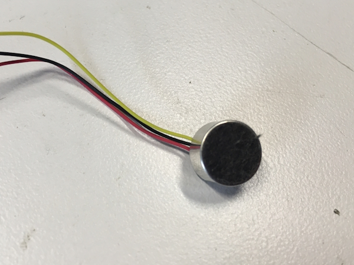

### Specifications

For this particular project, we needed a microphone with three specific characteristics:

(1) It needed to have a high acoustic overload point (AOP). This would allow the microphones 
to be located on the oustide of the ear-cans, very close to a full-volume acoustic 
drum set, and still not distort. Our final mic choice has a AOP of 135dB.

(2) It needed to have a large signal to noise ratio (SNR). This means that the 
microphone will output a cleaner signal with less "hiss" sound during quiet times. 
Something with at least 60dB or great would work. Our ultimate choice was for a microphone 
that had 75db SNR.

(3) It needed decent sensativity. Something near the range of -35dB would do. Note, 
when this number gets higher, that means it's more sensative. Because sensativity 
is almost always expressed as a negative number, that means a "smaller" negative 
number is more sensative.

To learn more about microphone specifications such as AOP, SNR, sensativity, please 
check out this very informative document from Invensense here:

[Invensense Application Note AN‐1112, MICROPHONE SPECIFICATIONS EXPLAINED](https://invensense.tdk.com/wp-content/uploads/2015/02/AN-1112-v1.1.pdf)

I tried three other microphones before I found my favorite. Here is a table to show 
the others options, and how they compare in terms of mic specs.

    <table>
        <tr>
            <th style="text-align: center; border: solid 1px #cccccc;">Mic
            </th>
            <th style="text-align: center; border: solid 1px #cccccc;">AOP
            </th>
            <th style="text-align: center; border: solid 1px #cccccc;">SNR
            </th>
            <th style="text-align: center; border: solid 1px #cccccc;">Sensativity
            </th>
            <th style="text-align: center; border: solid 1px #cccccc;">Notes
            </th>                        
        </tr>
        <tr>
             <td style="text-align: center; border: solid 1px #cccccc;">ICS-40180
            </td> 
            <td style="text-align: center; border: solid 1px #cccccc;">124dB
            </td>
            <td style="text-align: center; border: solid 1px #cccccc;">65dB
            </td>
            <td style="text-align: center; border: solid 1px #cccccc;">−38dB
            </td>
            <td style="text-align: center; border: solid 1px #cccccc;">With the onboard opamp gain, this ultimately had too low of an resulting AOP for drums. It clipped a lot when I played loudly.                    

            </td>
        </tr>
        <tr>
            <td style="text-align: center; border: solid 1px #cccccc;">SPH8878LR5H-1
            </td>
            <td style="text-align: center; border: solid 1px #cccccc;">134dB
            </td>
            <td style="text-align: center; border: solid 1px #cccccc;">66dB
            </td>
            <td style="text-align: center; border: solid 1px #cccccc;">-44dB
            </td>
            <td style="text-align: center; border: solid 1px #cccccc;">Again, with the onboard opamp gain, this ultimately had too low of an AOP for drums. It clipped a lot when I played loudly.                             

            </td>
        </tr>
        <tr>
            <td style="text-align: center; border: solid 1px #cccccc;">VM2020
            </td>
            <td style="text-align: center; border: solid 1px #cccccc;">149dB
            </td>
            <td style="text-align: center; border: solid 1px #cccccc;">50dB
            </td>
            <td style="text-align: center; border: solid 1px #cccccc;">-63dB
            </td>
            <td style="text-align: center; border: solid 1px #cccccc;">With such a high AOP, this mic could definitely handle the loud drums without clipping. This was a huge win, and actually, I used these mics for quite a while. But then I started to notice that during quite times, there was a significant "hiss" in the audio signal. This is because it is, in terms of audio microphones, not very sensative (-63dB). In order to hear the signal at a decent level, I had to add 60-70 dB of gain in the WM8960, which also can add some hiss to the signal.                       

            </td>
        </tr>
        <tr>
            <td style="text-align: center; border: solid 1px #cccccc;">AOM-5035L
            </td>
            <td style="text-align: center; border: solid 1px #cccccc;">135dB
            </td>
            <td style="text-align: center; border: solid 1px #cccccc;">75dB
            </td>
            <td style="text-align: center; border: solid 1px #cccccc;">-35dB
            </td>
            <td style="text-align: center; border: solid 1px #cccccc;">The best combination of high AOP, impressive sensativity and SNR. No clipping and no hiss. This one fits the job!                    

            </td>
        </tr>
    </table>

### Options

Here are the four microphones we ultimately tested. Note, although for our application, 
the AOM-5035 was the right choice, you might like to consider trying out some of the 
other mics and see if they work for your use case. If I were making these for playing 
piano or any kind of quieter environment, I might go with one of the MEMs.

-   <a href="https://www.sparkfun.com/products/18011">
      <figure markdown>
        
      </figure>
    </a>

    ---

    <a href="https://www.sparkfun.com/products/18011">
      <b>SparkFun Analog MEMS Microphone Breakout - ICS-40180</b>
       
      BOB-18011
    </a>
<!-- ----------WHITE SPACE BETWEEN PRODUCTS---------- -->
-   <a href="https://www.sparkfun.com/products/19389">
      <figure markdown>
        
      </figure>
    </a>

    ---

    <a href="https://www.sparkfun.com/products/19389">
      <b>SparkFun Analog MEMS Microphone Breakout - SPH8878LR5H-1</b>
       
      BOB-19389
    </a>
<!-- ----------WHITE SPACE BETWEEN PRODUCTS---------- -->
-   <a href="https://www.sparkfun.com/products/21537">
      <figure markdown>
        
      </figure>
    </a>

    ---

    <a href="https://www.sparkfun.com/products/21537">
      <b>SparkFun Analog MEMS Microphone Breakout - VM2020</b>
       
      BOB-21537
    </a>
<!-- ----------WHITE SPACE BETWEEN PRODUCTS---------- -->
-   <a href="https://www.digikey.com/en/products/detail/pui-audio-inc/AOM-5035L-HD3-LW100-R/16585488">
      <figure markdown>
        
      </figure>
    </a>

    ---

    <a href="https://www.digikey.com/en/products/detail/pui-audio-inc/AOM-5035L-HD3-LW100-R/16585488">
      <b>PUI Audio AOM-5035L-HD3-LW100-R</b>
    </a>
<!-- ----------WHITE SPACE BETWEEN PRODUCTS---------- -->

