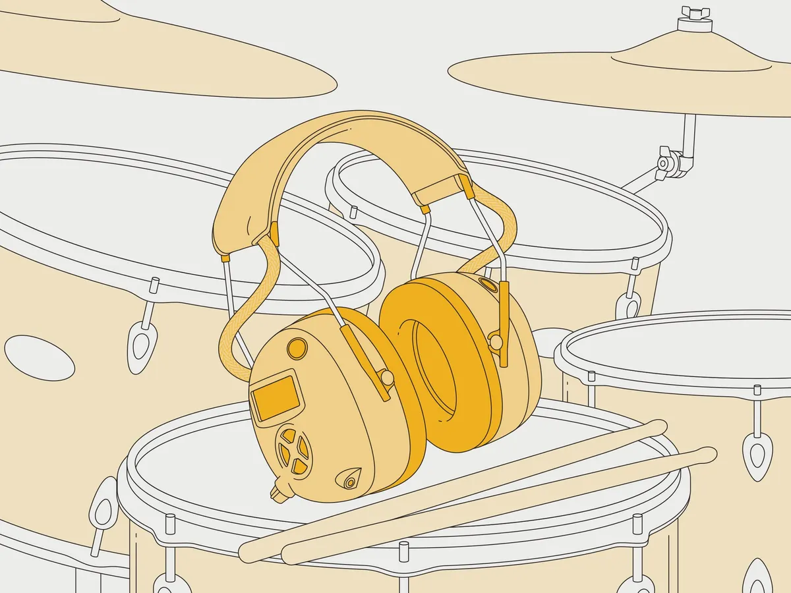

<!-- This section should include all the relevant documentation and product files (Eagle files, schematic, datasheet(s), landing pages, etc. and any relevant tutorials to go beyond the Hookup Guide.) -->

For more resources related to this project, check out the links listed here:

* General
    * [Arduino Code](../assets/code/Super_Headphones_BT_and_MIC_V2.0.zip) (ZIP)
    * [Block Diagram](../assets/img/Super_Headphones_Block_Diagram_v01.jpg) (JPG)
    * [Wiring Diagram](../assets/img/SuperHeadphones_Wiring_Diagram.jpg) (JPG)
    * [Mic Circuit](../assets/img/mic_circuit.png) (PNG)
    * [AOM-5035 Microphone Datasheet](../assets/component_documentation/PUI_Audio_AOM-5035L-HD3-LW100-R.pdf) (PDF)
    * [App Note on Mic Specs AN-1112-v1.1](../assets/component_documentation/AN-1112-v1.1.pdf) (PDF)
* Custom Mother-board PCB
    * [Schematic](../assets/board_files/Super_Headphones_Schematic_v20.pdf) (PDF)
    * [Eagle Files](../assets/board_files/Super_Headphones_Eagle_Files_v20.zip) (ZIP)
    * [Board Dimensions](../assets/board_files/Super_Headphones_Dimensions.png) (PNG)
    * [Board Dimensions](../assets/board_files/Super_Headphones_Dimensions.pdf) (PDF)
    * [Board Dimensions](../assets/board_files/Super_Headphones_Dimensions.dxf) (DXF)
* Audio Codec
    * [SparkFun Audio Codec Breakout - WM8960 (Qwiic) [BOB-21250]](https://www.sparkfun.com/products/21250)
    * [Hookup Guide](https://learn.sparkfun.com/tutorials/audio-codec-breakout---wm8960-hookup-guide)
    * [GitHub Hardware Repo](https://github.com/sparkfun/SparkFun_Audio_Codec_Breakout_WM8960)
    * [Arduino Library](https://github.com/sparkfun/SparkFun_WM8960_Arduino_Library)
    * [SFE WM8960 Product Showcase](https://www.youtube.com/embed/NvHIXSyEeDA)
* ESP32 Thing Plus
    * [SparkFun Thing Plus - ESP32 WROOM (USB-C) [WRL-20168]](https://www.sparkfun.com/products/20168)
    * [Hookup Guide](https://learn.sparkfun.com/tutorials/esp32-thing-plus-usb-c-hookup-guide)
    * [GitHub Hardware Repo](https://github.com/sparkfun/SparkFun_Thing_Plus_ESP32_WROOM_C)

Looking for more information related to the SuperHeadphones, check out the following IEEE article below!

<!-- ----------WHITE SPACE BETWEEN GRID CARDS---------- -->
-   <a href="https://spectrum.ieee.org/hi-fi-ear-defenders">
      <figure markdown>
         An inexpensive solution to hearing well in loud environments">
      </figure>
    </a>

    ---

    <a href="https://spectrum.ieee.org/hi-fi-ear-defenders">
      <b>IEEE: Build Your Own Hi-fi Ear Defenders >  An inexpensive solution to hearing well in loud environments</b>
    </a>
<!-- ----------WHITE SPACE BETWEEN GRID CARDS---------- -->

