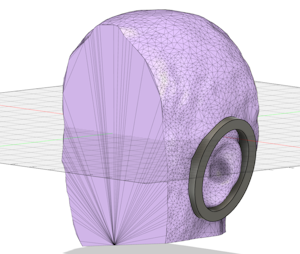

The next generation of super headphones might includes some additional features.
Here are some of my ideas:

### Mic Signal Output

With an additional WM8960 codec, I could send a copy of the isolated ambient mics to a line-level output. This would be handy for recording. Especially, if I just want to get an idea down with decent sound quality. The movement of my head (particularly rotationally) plays into the sound, so this is not ideal for recording for a final mix, but super handy for practice recordings.

### Advanced Audio Processing

It would be nice to take in the I2S audio from the codec and add some digital effects. For example EQ, compression and/or limiting could be very nice. I also find my carpeted basement to sound slightly tight. It would be killer to add in some reverb!

### Additional Mics

I have thought that adding a second set of ambient mics with higher sensitivity could be a nice improvement. Although the current mics (PUI-AOM-5035) do great for loud environments, it is not 100% ideal for use in quieter environments. If you want to capture quieter sound sources (like acoustic instruments such as piano, guitar or even conversation), then a more sensitive microphone is better suited for the job. A more sensitive microphone requires less gain to capture the quieter sounds, and thus produces less noise in those situations.

Mixing the two microphones automatically would be ideal. But this would require a rather uncommon effect on the sensitive  mic. You'd have to use an "inverted" noise gate. This would shut down the signal from the sensitive mic when it gets close to its clipping level, and then open up the gate to the high AOP mic at the same time.

It turns out that PUI makes another similar microphone that is 11dB more sensitive, and has a whopping 80dB SNR! See the specs here: [PUI AOM-5024](https://www.digikey.com/en/products/detail/pui-audio-inc/AOM-5024L-HD-F-R/12152286).

## Custom 3D Printed Cans!

Currently, the generic headphones I have hacked are pretty comfy, but I do notice the pressure of the pads on my ears. When I’m drumming, I don’t seem to mind - probably because I’m so focused on playing. But for general listening, I start to become a bit uncomfortable after 30 minutes or so. My ears are pretty long (I guess), and they angle out away from my head, so these headphones are essentially squishing my ears against my skull.

I've already begun the journey to creating some very custom headphones. I think that I should be able to make something that still has a really good seal to block out the loud sounds, but also is super comfy. I’ll probably make some for my kid too, because he needs to take breaks due to the ear-muffs causing some discomfort.

The basic idea I have is to scan in my head, then design some custom fit headphones.  Ideally, the cans and internal speaker drivers wouldn't touch my ears at all. Also, the touch points around my ears would have a custom adapter that would apply equal pressure all around.

It has started with a decent scan using photogrammetry. To learn more about this
process, check out this wonderful YouTube video by Punished Props Academy:

-   <a href="https://youtu.be/N3UvJW0HK4g?si=4_7vV_jP4GE8sXIP">
    <iframe width="560" height="315" src="https://www.youtube.com/embed/N3UvJW0HK4g?si=CjioR-8vK7SF32ar" title="YouTube video player" frameborder="0" allow="accelerometer; autoplay; clipboard-write; encrypted-media; gyroscope; picture-in-picture; web-share" allowfullscreen></iframe>

    ---

    **A great tutorial video on photogrammetry**</a>

After following along with that video, and doing a few practice scans, I was able
to successfully scan my head.

Then it is only a matter of importing the mesh into Fusion 360 and designing around the model of my head and ears.

Going into detail about how this is all done is beyond the scope of this tutorial, but I thought I'd share some of the photos from the design work that is currently still in progress.

Cheers and happy hacking!

-   <a href="../assets/img/pete_rotate2.gif">
      <figure markdown>
        
      </figure>
    </a>
<!-- ----------WHITE SPACE BETWEEN GRID CARDS---------- -->
-   <a href="../assets/img/custom1.png">
      <figure markdown>
        
      </figure>
    </a>
<!-- ----------WHITE SPACE BETWEEN GRID CARDS---------- -->
-   <a href="../assets/img/custom2.png">
      <figure markdown>
        
      </figure>
    </a>
<!-- ----------WHITE SPACE BETWEEN GRID CARDS---------- -->

<figure markdown>
[{ width="600" }](../assets/img/3d_print.jpg "Click to enlarge")
<figcaption markdown>
My first print... fresh out of the grey goop!
</figcaption>
</figure>
